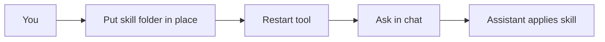

  <strong>Agent Skills</strong> 
  <em>A guide to the ecosystem</em>

  

---

**One place to understand agent skills, use them for the first time, and see how they fit across tools**—Cursor, Claude Code, VS Code, Copilot, and more.

---

## Table of contents

- [In 30 seconds](#in-30-seconds)
- [Who is this for?](#who-is-this-for)
- [How it works](#how-it-works)
- [How to use skills (first time)](#how-to-use-skills-first-time)
- [What you'll find in this guide](#what-youll-find-in-this-guide)
- [How to use this repo](#how-to-use-this-repo)
- [Contributing](#contributing)
- [Share](#share)

---

## In 30 seconds

> **Agent skills** are markdown instructions (and optional scripts) that tell your AI assistant *what* to do, *when* to do it, and *how*. Put a folder with a `SKILL.md` file in the right place, restart your tool, and the assistant applies the skill automatically when your request matches—no extra commands or buttons.

**First time?** → [How to use skills (first time)](docs/00-how-to-use-skills-first-time.md)

---

## Who is this for?

| You are… | Start here |
|----------|------------|
| **First-time user** – never used agent skills | [How to use skills (first time)](docs/00-how-to-use-skills-first-time.md) |
| **Developer** – want consistent commits, reviews, conventions | [Get started with Cursor](docs/05-cursor-and-more.md) or [Understand the standard](docs/01-spec-and-docs.md) |
| **Tech lead** – standardize how the team uses AI tools | [Understand the standard](docs/01-spec-and-docs.md) → [Explore the ecosystem](docs/02-curated-lists.md) |
| **Builder** – creating skills for your stack | [Vendor and platform resources](docs/03-official-catalogs.md) + [Community and cross-platform](docs/04-community-collections.md) |

---

## How it works

1. **You** create a folder with a `SKILL.md` file (name, description, instructions).
2. **Put** the folder in your tool’s skills path (personal or project).
3. **Restart** your tool (e.g. Cursor) so it loads the skill.
4. **Ask** in natural language (e.g. “Suggest a commit message”).
5. **Assistant** applies the skill when your request matches the description.

---

## How to use skills (first time)

If you’ve never used agent skills, start here.

### 1. What they are

Skills are markdown instructions (and optional scripts) that tell your AI assistant *what* to do, *when* to do it, and *how*—for example, “write commit messages in this format when I ask for a commit message.”

### 2. Where they live

Each skill is a **folder** with a **SKILL.md** file inside.

| Scope | Path |
|-------|------|
| **Personal** (all projects) | Windows: `%USERPROFILE%\.cursor\skills\<name>\` · macOS/Linux: `~/.cursor/skills/<name>/` |
| **Project** (one repo) | `<repo>/.cursor/skills/<name>/` |

### 3. How you use them

Put the folder in place → restart your tool (e.g. Cursor) → use it as usual. When you ask for something that matches the skill’s description, the assistant applies that skill. **No extra commands or buttons.**

### 4. Your first skill

Create a folder, add a minimal `SKILL.md` (name + description + a few steps), restart, and ask something that matches—e.g. *“Summarize the README.”*

**Full walkthrough:** [How to use skills (first time)](docs/00-how-to-use-skills-first-time.md)

---

## What you'll find in this guide

| # | Topic | What's inside |
|---|--------|----------------|
| [00](docs/00-how-to-use-skills-first-time.md) | **How to use skills (first time)** | What they are, where they live, how to use them, your first skill |
| [01](docs/01-spec-and-docs.md) | **Understand the standard** | The open format (SKILL.md, name, description) and why it matters |
| [02](docs/02-curated-lists.md) | **Explore the ecosystem** | Platforms that support skills and kinds of skills people build |
| [03](docs/03-official-catalogs.md) | **Vendor and platform resources** | Where to find official docs and skill catalogs for your tool |
| [04](docs/04-community-collections.md) | **Community and cross-platform** | Community-built skills and patterns that work across tools |
| [05](docs/05-cursor-and-more.md) | **Get started with Cursor** | How to use skills in Cursor, step by step |

---

## How to use this repo

- **First time with skills?** → [How to use skills (first time)](docs/00-how-to-use-skills-first-time.md)
- **Want the big picture?** → [Understand the standard](docs/01-spec-and-docs.md) then [Explore the ecosystem](docs/02-curated-lists.md)
- **Using Cursor?** → [Get started with Cursor](docs/05-cursor-and-more.md)
- **Building your own skills?** → [Vendor and platform resources](docs/03-official-catalogs.md) + [Community and cross-platform](docs/04-community-collections.md)

---

## Contributing

Suggestions for clearer structure, fixes, or new sections: open an [issue](https://github.com/beejak/agent-skills-curated/issues) or [pull request](https://github.com/beejak/agent-skills-curated/pulls).

---

## Share

If this guide helps you, consider sharing it with your network or team—LinkedIn, Twitter/X, or your company’s internal channels.

---

  For developers and teams adopting AI-assisted workflows. Not affiliated with any vendor. 
  <a href="LICENSE">License: MIT</a>

